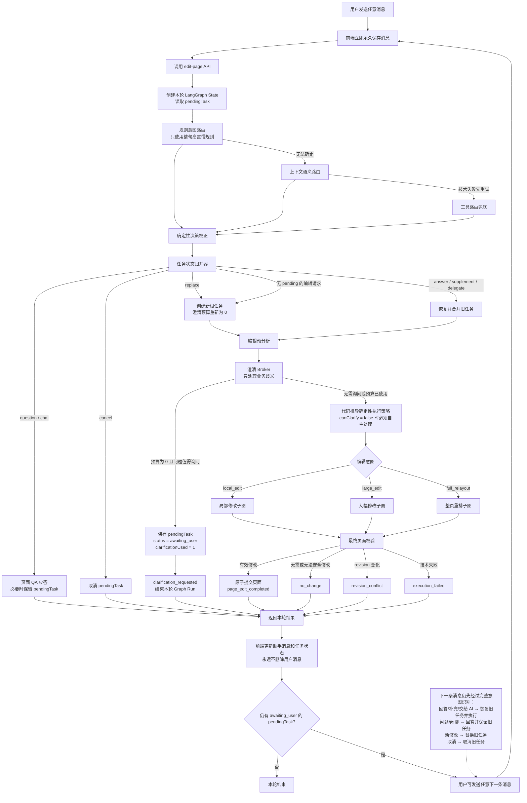

# AI 页面修改跨轮完整实现链路

> 一条用户消息对应一次 Graph Run；`clarification_requested` 只结束本轮调用，不结束业务任务。

```mermaid
flowchart TD
    U[用户发送任意消息] --> M[前端立即永久保存消息]
    M --> API[调用 edit-page API]
    API --> S[创建本轮 LangGraph State<br/>读取 pendingTask]

    S --> R1[规则意图路由<br/>只使用整句高置信规则]
    R1 -->|无法确定| R2[上下文语义路由]
    R2 -->|技术失败先重试| R3[工具路由兜底]
    R1 --> N[确定性决策校正]
    R2 --> N
    R3 --> N

    N --> T[任务状态归并器]
    T -->|question / chat| QA[页面 QA 应答<br/>必要时保留 pendingTask]
    T -->|cancel| C[取消 pendingTask]
    T -->|replace| NEW[创建新根任务<br/>澄清预算重新为 0]
    T -->|answer / supplement / delegate| OLD[恢复并合并旧任务]
    T -->|无 pending 的编辑请求| NEW

    NEW --> P[编辑预分析]
    OLD --> P
    P --> B[澄清 Broker<br/>只处理业务歧义]

    B -->|预算为 0 且问题值得询问| SAVE[保存 pendingTask<br/>status = awaiting_user<br/>clarificationUsed = 1]
    SAVE --> Q[clarification_requested<br/>结束本轮 Graph Run]

    B -->|无需询问或预算已使用| EP[代码推导确定性执行策略<br/>canClarify = false 时必须自主处理]
    EP --> D{编辑意图}
    D -->|local_edit| L[局部修改子图]
    D -->|large_edit| G[大幅修改子图]
    D -->|full_relayout| F[整页重排子图]

    L --> V[最终页面校验]
    G --> V
    F --> V

    V -->|有效修改| COMMIT[原子提交页面<br/>page_edit_completed]
    V -->|无需或无法安全修改| NC[no_change]
    V -->|revision 变化| RC[revision_conflict]
    V -->|技术失败| E[execution_failed]

    QA --> OUT[返回本轮结果]
    C --> OUT
    Q --> OUT
    COMMIT --> OUT
    NC --> OUT
    RC --> OUT
    E --> OUT

    OUT --> UI[前端更新助手消息和任务状态<br/>永远不删除用户消息]
    UI --> WAIT{仍有 awaiting_user 的 pendingTask?}
    WAIT -->|否| DONE[本轮结束]
    WAIT -->|是| NEXT[用户可发送任意下一条消息]
    NEXT --> M

    NOTE[下一条消息仍先经过完整意图识别：<br/>回答/补充/交给 AI → 恢复旧任务并执行<br/>问题/闲聊 → 回答并保留旧任务<br/>新修改 → 替换旧任务<br/>取消 → 取消旧任务] -.-> NEXT
```

